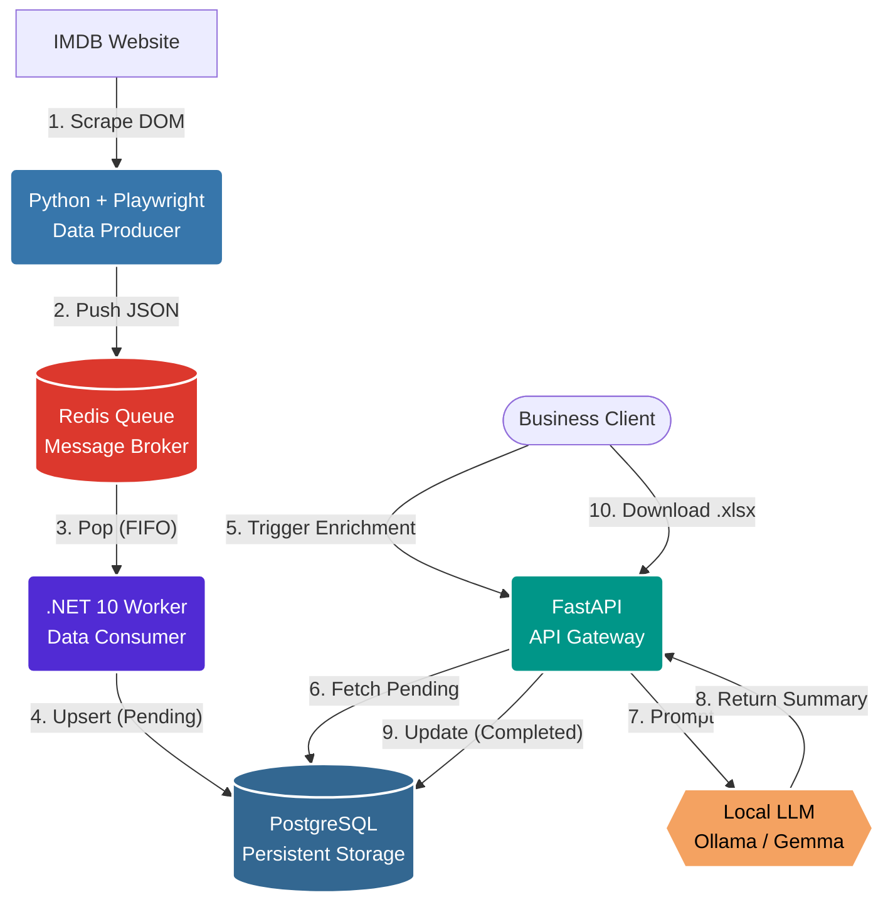

# IMDB AI Pipeline: Enterprise Data Extraction & Enrichment

A high-performance, distributed data pipeline. It scrapes the IMDb Top 250 chart using asynchronous Playwright, streams the data into a Redis message broker, processes it asynchronously with a blazing-fast .NET 10 Worker, and uses a FastAPI gateway to enrich the data using Local LLMs (Ollama) and export business reports to Excel.

## 🏗️ Architecture Overview

This project implements an Event-Driven ETL (Extract, Transform, Load) architecture:



1. **Scraper (Python):** Extracts raw data from the DOM, blocks heavy resources, and pushes JSON payloads to Redis.
2. **Message Broker (Redis):** Holds the `movies_queue` to ensure zero data loss.
3. **Background Worker (.NET 10 + Dapper):** Listens to the queue, deserializes payloads, and performs a SQL UPSERT into the database.
4. **API Gateway (FastAPI):** Exposes a Swagger UI, orchestrates AI enrichment via local LLM, and generates `.xlsx` reports on the fly.
5. **Database (PostgreSQL):** Final persistent storage for the movies and AI summaries.

## 🚀 Quick Start (Docker Compose)

The easiest way to run the entire microservice architecture is using Docker Compose.

**1. Start the Infrastructure, Worker, and API**
```bash
docker compose up -d postgres redis redis-insight worker api
```
*Wait a few seconds for the databases to initialize.*

**2. Access the UIs**
- **Redis Insight:** [http://localhost:5540](http://localhost:5540) (Monitor the message queue)
- **FastAPI Swagger UI:** [http://localhost:8000/docs](http://localhost:8000/docs) (API Endpoints)

**3. Run the Scraper (Data Ingestion)**
```bash
docker compose start scraper
```
The scraper will launch a headless Chromium instance, scrape the movies, push them to the Redis queue, and exit. The `.NET worker` will instantly pick up the payloads and save them to PostgreSQL with a `pending` status.

## 🪄 AI Enrichment (Local LLM)

This pipeline integrates with local LLMs running on your host machine (e.g., Ollama with the `gemma4:e4b` model) to generate engaging summaries for the scraped movies.

**1. Start Ollama on your host machine:**
Ensure Ollama is listening on all interfaces so the Docker container can reach it. Using PowerShell:
```powershell
$env:OLLAMA_HOST="0.0.0.0"; ollama run gemma4:e4b
```

**2. Trigger the Enrichment API:**
Go to the Swagger UI ([http://localhost:8000/docs](http://localhost:8000/docs)), open the `POST /movies/enrich` endpoint, set a limit, and execute. The API will fetch pending movies, generate summaries via Ollama, and update their status to `completed`.

## 📊 Excel Export

Business users can download a complete report containing movie data and AI-generated summaries in Excel format (`.xlsx`) by navigating to:
[http://localhost:8000/movies/export](http://localhost:8000/movies/export)

## 📦 Message Payload Format (Redis)

The scraper publishes a JSON object to the `movies_queue` list in Redis. The .NET Worker deserializes this payload:

```json
{
  "rank": 1,
  "imdb_id": "tt0111161",
  "title": "The Shawshank Redemption",
  "imdb_url": "https://www.imdb.com/title/tt0111161/",
  "image_url": "https://m.media-amazon.com/images/...",
  "rating": 9.3,
  "votes": "3.2M",
  "votes_count": 3200000
}
```

## 💻 Local Development (Python Scraper)

To run the scraper manually without Docker:
```powershell
pip install -r src/scraper_python/requirements.txt
python -m playwright install chromium

python src/scraper_python/src/imdb_top.py --limit 10
```

## 🧪 Tests & Code Quality

Run tests:
```powershell
python -m unittest discover -s src/scraper_python/tests
```

Run Ruff linting and formatting:
```powershell
ruff check .
ruff format .
```