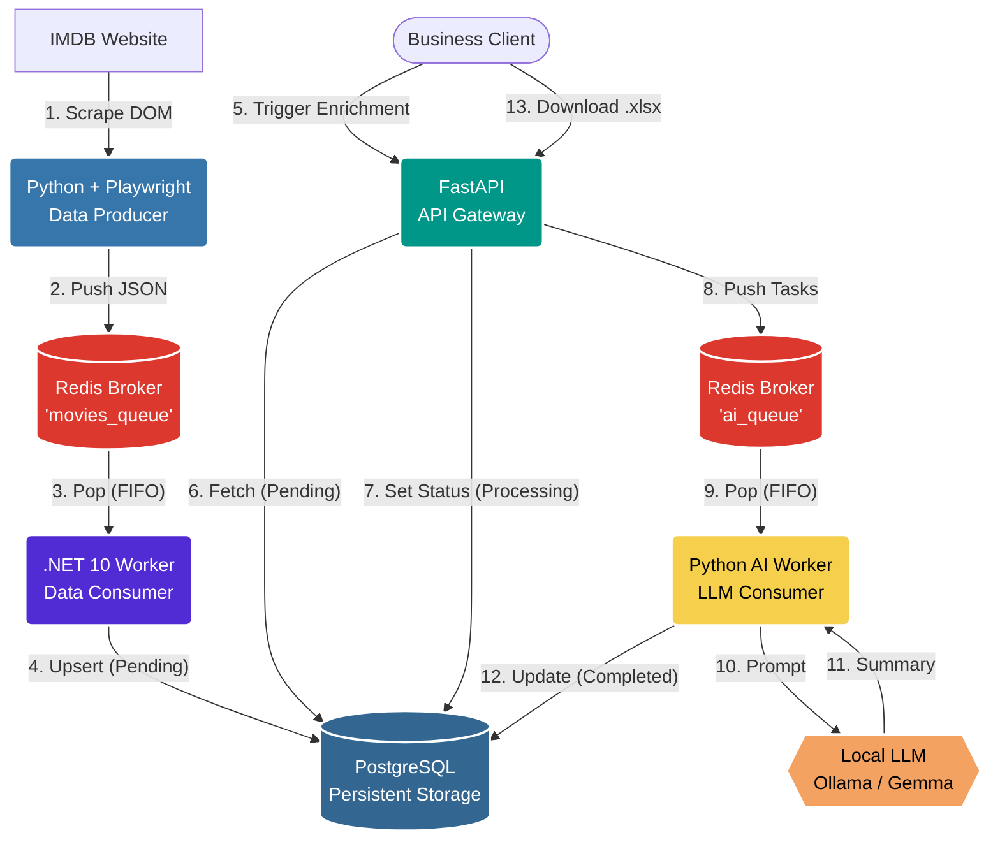

# IMDB AI Pipeline: Enterprise Data Extraction & Enrichment

A high-performance, distributed data pipeline. It scrapes the IMDb Top 250 chart using asynchronous Playwright, streams the data into a Redis message broker, processes it asynchronously with a blazing-fast .NET 10 Worker, and uses a decoupled Python AI Worker to enrich data via Local LLMs (Ollama), all orchestrated by a FastAPI gateway.

## 🏗️ Architecture Overview

This project implements a fully decoupled Event-Driven ETL (Extract, Transform, Load) architecture with isolated asynchronous task queues:



### Components:
1. **Scraper (Python):** Extracts raw data from the DOM, blocks heavy resources, and pushes payloads to the `movies_queue`.
2. **Message Broker (Redis):** Holds isolated queues (`movies_queue` and `ai_queue`) to ensure zero data loss and enable asynchronous processing.
3. **Data Worker (.NET 10 + Dapper):** Listens to `movies_queue`, deserializes payloads, and performs a SQL UPSERT into PostgreSQL.
4. **API Gateway (FastAPI):** Exposes Swagger UI, exports `.xlsx` reports, locks records by setting them to `processing`, and pushes AI tasks to the `ai_queue`.
5. **AI Worker (Python):** A dedicated background worker listening to `ai_queue`. It communicates with the Local LLM one-by-one to prevent VRAM Out-Of-Memory (OOM) errors and timeouts.
6. **Database (PostgreSQL):** Final persistent storage for movies and AI summaries.

## 🚀 Quick Start (Docker Compose)

The easiest way to run the entire microservice architecture is using Docker Compose.

**1. Start the Infrastructure, Workers, and API**
```bash
docker compose up -d postgres redis redis-insight worker api worker_ai
```
*Wait a few seconds for the databases to initialize.*

**2. Access the UIs**
- **Redis Insight:** [http://localhost:5540](http://localhost:5540) (Monitor the message queues)
- **FastAPI Swagger UI:** [http://localhost:8000/docs](http://localhost:8000/docs) (API Endpoints)

**3. Run the Scraper (Data Ingestion)**
```bash
docker compose start scraper
```
The scraper will push data to the queue, and the `.NET worker` will instantly pick up the payloads and save them to PostgreSQL with a `pending` status.

## 🪄 AI Enrichment (Local LLM)

This pipeline integrates with local LLMs running on your host machine (e.g., Ollama with the `gemma4:e4b` model) using an asynchronous job queue.

**1. Start Ollama on your host machine:**
Ensure Ollama is listening on all interfaces so the Docker container can reach it. Using PowerShell:
```powershell
$env:OLLAMA_HOST="0.0.0.0"; ollama run gemma4:e4b
```

**2. Trigger the Enrichment API:**
Go to the Swagger UI ([http://localhost:8000/docs](http://localhost:8000/docs)), open the `POST /movies/enrich` endpoint, and execute. 
*Note: The API returns `HTTP 202 Accepted` instantly. The dedicated AI Worker processes the tasks in the background and updates the database.*

## 📊 Excel Export

Business users can download a complete report containing movie data and AI-generated summaries in Excel format (`.xlsx`) by navigating to:
[http://localhost:8000/movies/export](http://localhost:8000/movies/export)

## 💻 Local Development (Python Scraper)

To run the scraper manually without Docker:
```powershell
pip install -r src/scraper_python/requirements.txt
python -m playwright install chromium

python src/scraper_python/src/imdb_top.py --limit 10
```

## 🧪 Tests & Code Quality

Run tests:
```powershell
python -m unittest discover -s src/scraper_python/tests
```

Run Ruff linting and formatting:
```powershell
ruff check .
ruff format .
```