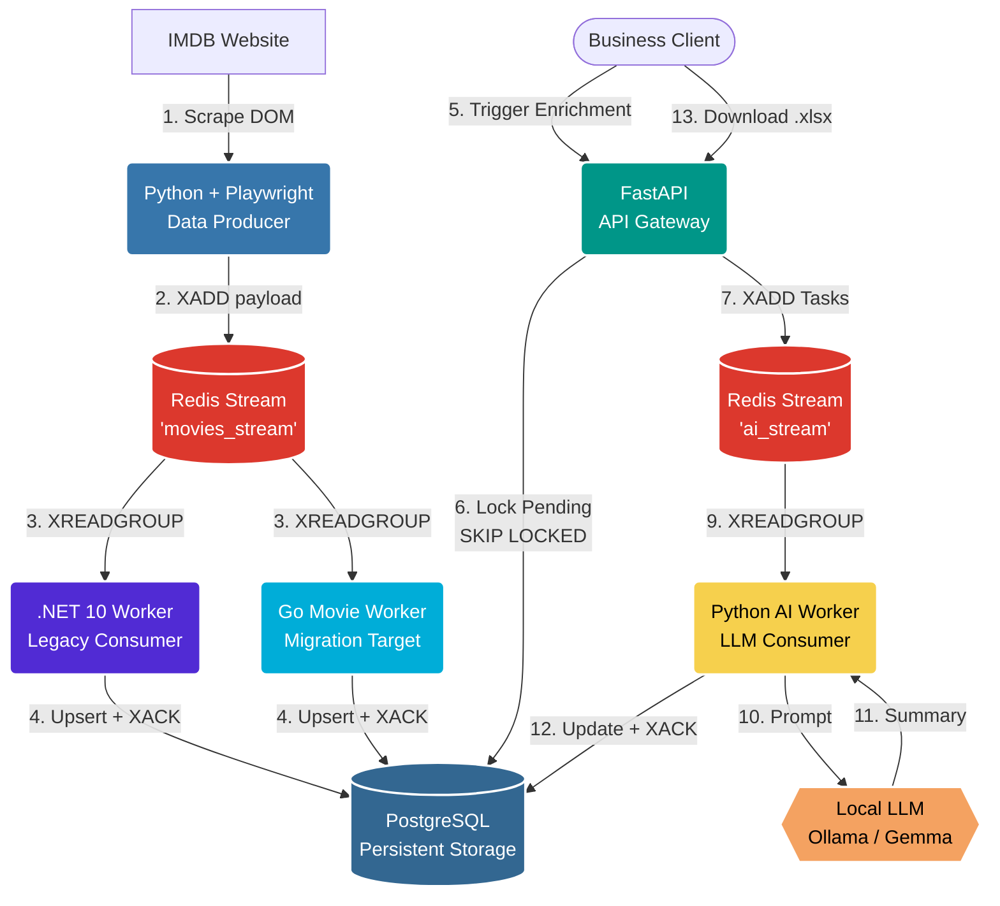

# IMDB AI Pipeline: Enterprise Data Extraction & Enrichment

A high-performance, distributed data pipeline. It scrapes the IMDb Top 250 chart using asynchronous Playwright, streams the data into a Redis message broker, processes it asynchronously using concurrent workers, and uses a decoupled Python AI Worker to enrich data via Local LLMs (Ollama), all orchestrated by a FastAPI gateway.

## 🏗️ Architecture Overview

This project implements a fully decoupled Event-Driven ETL (Extract, Transform, Load) architecture with isolated Redis Streams, consumer groups, strict Pydantic Data Contracts, and Self-Healing capabilities. It is currently in a migration/coexistence state: the legacy .NET 10 Worker remains the reference ingestion service, while `worker_go` has been added as the Go-based transit implementation that will be tested side by side before the final cutover.

## Worker Migration: .NET to Go

The movie ingestion layer is intentionally running in a transition mode according to [ADR-001](docs/adr/001-migration-from-dotnet-to-go-worker.md).

- `src/worker_dotnet` / `worker`: current .NET 10 Worker and baseline implementation.
- `src/worker_go` / `worker_go`: Golang Worker added for transit and future replacement of the .NET service.
- Both workers consume `movies_stream` through Redis consumer groups and persist normalized movie data into PostgreSQL.
- The next phase is comparative testing of both services and collecting the final migration results.
- After the test results are accepted, the pipeline will be switched fully to `worker_go`; the .NET worker can then be removed or kept only as a rollback reference.

The rationale, alternatives, and expected operational impact are documented in ADR-001.
