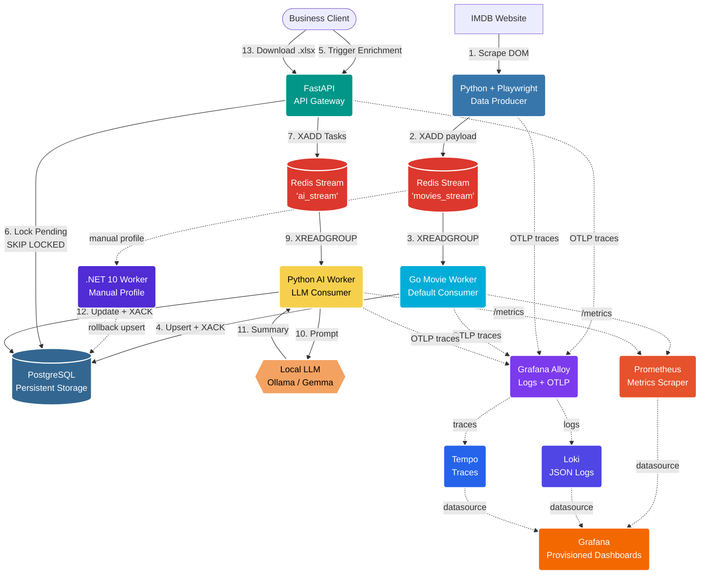

# IMDB AI Pipeline: Enterprise Data Extraction & Enrichment

A high-performance, distributed data pipeline. It scrapes IMDb charts using asynchronous Playwright, streams the data into Redis, persists normalized movie records with the Go worker, and uses a decoupled Python AI worker to enrich data via Local LLMs (Ollama), all orchestrated by a FastAPI gateway and Docker Compose.

## 🏗️ Architecture Overview

This project implements a fully decoupled Event-Driven ETL (Extract, Transform, Load) architecture with isolated Redis Streams, consumer groups, strict data contracts, structured JSON logging, and end-to-end OpenTelemetry tracing. The runtime stack has migrated back to Docker: `docker compose` is the default orchestration path, while the legacy .NET worker is kept behind the `manual` profile as a rollback and benchmark reference.



## Runtime

Copy `.env.example` to `.env`, adjust credentials and Ollama settings, then start the stack:

```bash
docker compose up -d
```

Useful commands:

```bash
docker compose ps
docker compose logs -f api worker_go worker_ai
docker compose run --rm scraper
docker compose --profile manual up -d worker
```

The default ingestion path is `scraper -> movies_stream -> worker_go -> PostgreSQL`.
The legacy `.NET` worker is no longer part of the default runtime and starts only with the
`manual` profile.

## Observability

The Compose stack includes Prometheus, Grafana, Loki, Tempo, and Grafana Alloy. Prometheus
scrapes worker metrics, Alloy collects Docker JSON logs and receives OTLP traces, Loki stores
logs, Tempo stores traces, and Grafana provisions all datasources from repository-managed files.

Local endpoints:

- Prometheus: `http://localhost:9090`
- Grafana: `http://localhost:3000`
- Loki: `http://localhost:3100`
- Tempo: `http://localhost:3200`
- Alloy UI: `http://localhost:12345`

Prometheus runs as the `prometheus` service and uses
`infra/prometheus/prometheus.yml` as its scrape configuration. It collects metrics from:

- Python AI Worker: `http://localhost:8001/metrics`
- Go Movie Worker: `http://localhost:2112/metrics`

Key application metrics:

- `ai_tasks_processed_total`: AI worker task outcomes by `status`
  (`completed`, `failed`, `contract_violation`, `missing_payload`).
- `llm_request_duration_seconds`: local LLM generation latency.
- `llm_summary_characters`: successful LLM summary length.
- `movies_processed_total`: Go worker processing outcomes by `status`
  (`success`, `db_error`, `validation_error`).

Grafana runs as the `grafana` service. Its Prometheus datasource and dashboard panels are
provisioned as infrastructure as code:

- Datasource: `infra/grafana/provisioning/datasources/datasource.yml`
- Dashboard provider: `infra/grafana/provisioning/dashboards/dashboard.yml`
- Ready-made panels: `infra/grafana/provisioning/dashboards/imdb_pipeline.json`
- Alloy pipeline: `infra/alloy/config.alloy`
- Tempo config: `infra/tempo/tempo.yaml`

Application services emit structured JSON logs with OpenTelemetry correlation fields
(`traceID`, `spanID`) when a span is active. Grafana's Loki datasource is configured with a
derived `TraceID` field that links logs to Tempo traces.

The traced flow covers the request path from `POST /movies/scrape?chart=...` in the API,
through the scraper container, movie publication to Redis, Go worker persistence,
`POST /movies/enrich` task fan-out, and AI worker LLM enrichment. Scraped movie records store the W3C
`traceparent` in PostgreSQL so enrichment traces can be linked back to the original scraping
trace.

The provisioned `IMDB AI PIPELINE` dashboard includes panels for average Ollama latency,
average summary length, Go ingestion rate, AI task processing rate, logs, and traces.

## Data Contracts and Persistence

Movie ingestion payloads include:

- `imdb_id`, `title`, `rating`, `votes`, `image_url`
- `rank` and `chart` as transport metadata
- `traceparent` for distributed tracing

PostgreSQL persists the normalized movie fields and trace context. `rank` is intentionally no
longer stored in the `movies` table; `rank` and `chart` remain in the transport models so they
can be persisted later without breaking service contracts.

## Worker Migration: .NET to Go

The movie ingestion layer has moved to Go according to [ADR-001](docs/adr/001-migration-from-dotnet-to-go-worker.md). `worker_go` is the default service in Docker Compose and persists movies into PostgreSQL. The legacy `.NET` worker remains available for manual comparison and rollback experiments.

- `src/worker_go` / `worker_go`: default Go ingestion worker.
- `src/worker_dotnet` / `worker`: legacy .NET 10 worker, disabled by default through the `manual` Compose profile.
- Both workers understand `movies_stream`, but only `worker_go` runs in the default stack.
- Prometheus, Grafana, Loki, and Tempo are used to compare runtime behavior, ingestion rate, operational stability, logs, and traces.
- Comparative load testing of both services has been successfully executed, with Go demonstrating a 2.2x throughput gain and a 5.3x memory footprint reduction (see [Migration Benchmarks](#-migration-benchmarks--finops-analysis-net-vs-go) below).

The rationale, alternatives, and expected operational impact are documented in ADR-001.

## 📈 Migration Benchmarks & FinOps Analysis (.NET vs Go)

We conducted a high-concurrency isolated load test of **10,000,000 messages** to compare the operational efficiency, latency profiles, and resource consumption of the legacy .NET 10 Worker against the Go 1.24 Worker.

The benchmark runs with database writes bypassed (`_simulateDbSave` and `SimulateDbSave` active) to isolate the CPU scheduler, memory allocator, and Redis network performance.

### Performance Benchmark Summary

| Engineering Metric | .NET 10 Worker (`worker_dotnet`) | Go 1.24 Worker (`worker_go`) | Architectural & FinOps Impact |
| :--- | :--- | :--- | :--- |
| **Peak Throughput (RPS)** | ~350 - 450 RPS | **~750 - 950 RPS** | **~2.2x higher throughput**, enabling faster message backlog draining. |
| **Median Latency (P50)** | 1.1 ms | **0.5 ms** | **2.2x faster execution** under standard load due to zero runtime runtime abstraction overhead. |
| **95th Percentile Latency (P95)** | ~2.8 ms | **~1.3 ms** | **2.1x lower latency** for 95% of processing cycles. |
| **99th Percentile Latency (P99)** | ~7.0 - 9.0 ms | **~3.5 - 5.0 ms** | **Over 2x flatter tail latency**. Go maintains predictable execution; .NET spikes are caused by GC pause jitter. |
| **RAM Footprint (Working Set)** | ~96 MiB | **~18 MiB** | **5.3x memory reduction**, enabling high-density container packing and lower AWS Fargate fees. |
| **Startup Time (Cold Start)** | ~1,800 ms | **~15 ms** | **50x faster scaling**. Go scales out instantly under load; .NET lags due to CLR and JIT initialization. |

### Ingestion Telemetry (Grafana Benchmark Panel)

The screenshot below displays the live telemetry captured during the 10M message stream processing, contrasting the throughput capacity, flat latency profile of Go, and the stark memory footprint gap:


*For more details on the experimental environment, load test scripts, and complete raw data, refer to the [Full Ingestion Benchmark Report](docs/benchmarks/dotnet-vs-go-ingestion.md).*
