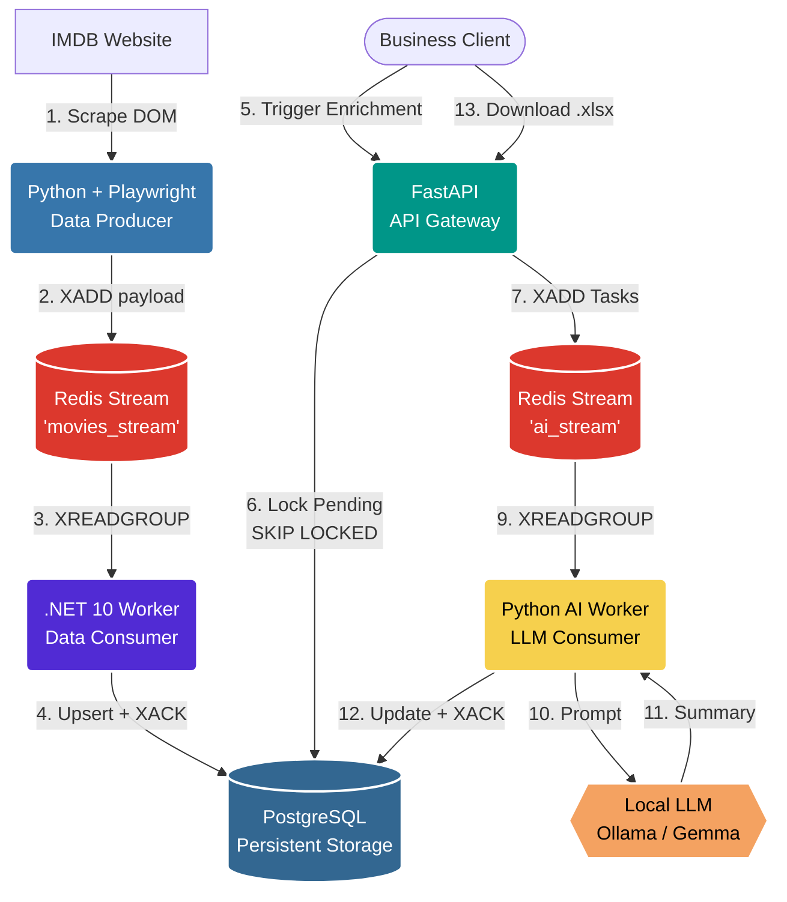

# IMDB AI Pipeline: Enterprise Data Extraction & Enrichment

A high-performance, distributed data pipeline. It scrapes the IMDb Top 250 chart using asynchronous Playwright, streams the data into a Redis message broker, processes it asynchronously with a blazing-fast .NET 10 Worker, and uses a decoupled Python AI Worker to enrich data via Local LLMs (Ollama), all orchestrated by a FastAPI gateway.

## 🏗️ Architecture Overview

This project implements a fully decoupled Event-Driven ETL (Extract, Transform, Load) architecture with isolated Redis Streams, consumer groups, strict Pydantic Data Contracts, and Self-Healing capabilities:



### Components:
1. **Scraper (Python):** Extracts raw data from the DOM, blocks heavy resources, and publishes payloads to the `movies_stream`.
2. **Message Broker (Redis):** Holds isolated streams (`movies_stream` and `ai_stream`) with consumer groups and explicit acknowledgements.
3. **Data Worker (.NET 10 + Dapper):** Reads `movies_stream`, deserializes payloads, performs a SQL UPSERT into PostgreSQL, and acknowledges processed stream entries.
4. **API Gateway (FastAPI):** Exposes Swagger UI with strictly typed response schemas via `Pydantic`, exports `.xlsx` reports, provides health/readiness probes, atomically locks records with `FOR UPDATE SKIP LOCKED`, and publishes AI tasks to the `ai_stream`.
5. **AI Worker (Python):** A dedicated background worker reading `ai_stream`. It validates incoming tasks using strict `Pydantic` Data Contracts and communicates with the Local LLM one-by-one with a bounded request timeout to prevent indefinite hangs.
6. **Database (PostgreSQL):** Final persistent storage for movies and AI summaries.

### Enterprise Features:
1. **Asynchronous Producers & Consumers:** Data is scraped, buffered in Redis, and consumed by isolated background workers to prevent bottlenecks.
2. **Strict Data Contracts:** JSON payloads are validated across microservices using `Pydantic` to prevent silent failures and corrupt data injection.
3. **Reliable Stream Processing:** Redis Streams consumer groups keep delivered messages pending until workers explicitly acknowledge them with `XACK`.
4. **Self-Healing System:** Solves the "Zombie Task" problem. If the Local LLM crashes or times out, the system automatically catches the exception, unlocks the record, and resets its status to `pending` for future retries.
5. **Concurrency-Safe Enrichment:** The enrichment endpoint locks `pending` rows with PostgreSQL `FOR UPDATE SKIP LOCKED`, so overlapping API requests do not queue the same movies twice.
6. **Operational Probes:** The API exposes `/health` for liveness and `/ready` for PostgreSQL/Redis readiness checks.
7. **VRAM Protection:** AI enrichment is offloaded to a dedicated stream, processing prompts one-by-one to prevent Local LLM Out-Of-Memory (OOM) crashes.

## 🚀 Quick Start (Docker Compose)

The easiest way to run the entire microservice architecture is using Docker Compose.

**1. Start the Infrastructure, Workers, and API**
```bash
docker compose up -d postgres redis redis-insight worker api worker_ai
```

**2. Access the UIs**
- **Redis Insight:** [http://localhost:5540](http://localhost:5540) (Monitor Redis Streams)
- **FastAPI Swagger UI:** [http://localhost:8000/docs](http://localhost:8000/docs) (API Endpoints)
- **API Health:** [http://localhost:8000/health](http://localhost:8000/health)
- **API Readiness:** [http://localhost:8000/ready](http://localhost:8000/ready)

**3. Run the Scraper (Data Ingestion)**
```bash
docker compose start scraper
```
The `.NET worker` will pick up payloads from `movies_stream`, save them to PostgreSQL with a `pending` status, and acknowledge each processed stream entry.

## 🪄 AI Enrichment (Local LLM) & Self-Healing

Integrates with local LLMs (e.g., Ollama with the `gemma4:e4b` model) using an asynchronous Redis Stream.

**1. Start Ollama on your host machine:**
Using PowerShell, ensure Ollama listens on all interfaces:
```powershell
$env:OLLAMA_HOST="0.0.0.0"; ollama run gemma4:e4b
```

**2. Trigger the Enrichment API:**
Open the Swagger UI, navigate to `POST /movies/enrich`, and execute. The API locks a batch of `pending` movies, publishes tasks to `ai_stream`, and returns `HTTP 202 Accepted` while generation continues in the background.

**3. Recover Stuck Tasks (Self-Healing):**
If the host machine loses power or the LLM crashes, you can recover stuck tasks via the `POST /movies/recover` endpoint. It scans the database for zombie processes and safely reverts them to `pending`. The `stuck_minutes` parameter is validated and passed to PostgreSQL as a query parameter.

**4. Tune LLM Timeout:**
Set `LLM_TIMEOUT_SECONDS` in `.env` to control the maximum duration of a single Ollama generation request. The default is `600` seconds.

## 📊 Excel Export

Business users can download a complete report containing movie data and AI-generated summaries in Excel format (`.xlsx`) by navigating to:
[http://localhost:8000/movies/export](http://localhost:8000/movies/export)

## 🧪 Tests & Code Quality

Run tests:
```powershell
python -m unittest discover -s src/scraper_python/tests
```

Run Ruff linting and formatting:
```powershell
ruff check .
ruff format .
```
