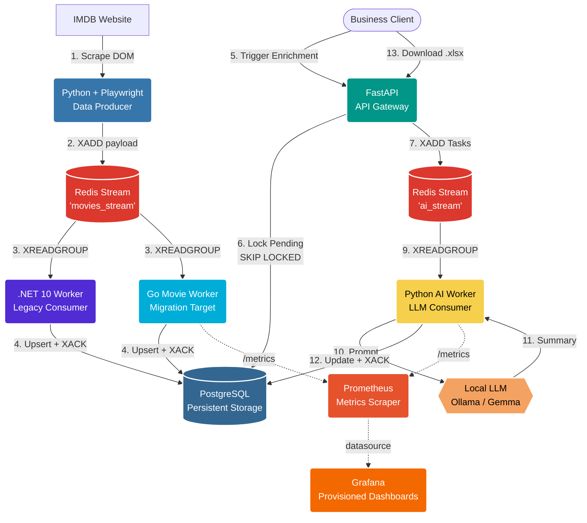
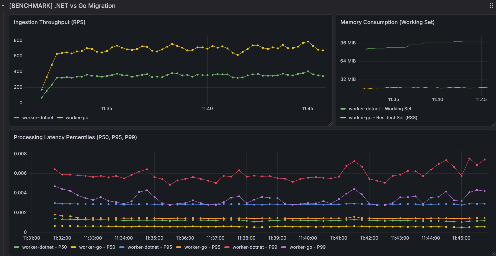

# IMDB AI Pipeline: Enterprise Data Extraction & Enrichment

A high-performance, distributed data pipeline. It scrapes the IMDb Top 250 chart using asynchronous Playwright, streams the data into a Redis message broker, processes it asynchronously using concurrent workers, and uses a decoupled Python AI Worker to enrich data via Local LLMs (Ollama), all orchestrated by a FastAPI gateway.

## 🏗️ Architecture Overview

This project implements a fully decoupled Event-Driven ETL (Extract, Transform, Load) architecture with isolated Redis Streams, consumer groups, strict Pydantic Data Contracts, and Self-Healing capabilities. It is currently in a migration/coexistence state: the legacy .NET 10 Worker remains the reference ingestion service, while `worker_go` has been added as the Go-based transit implementation that will be tested side by side before the final cutover.



## Observability and Metrics

The Compose stack includes a monitoring profile with Prometheus and Grafana. Prometheus
scrapes application metrics from the high-throughput workers, while Grafana publishes a
ready-made dashboard from repository-managed provisioning files.

Start the monitoring services together with the pipeline:

```bash
docker compose --profile monitoring up -d
```

Monitoring endpoints:

- Prometheus: `http://localhost:9090`
- Grafana: `http://localhost:3000`

Prometheus runs as the `prometheus` service and uses
`infra/prometheus/prometheus.yml` as its scrape configuration. It collects metrics from:

- Python AI Worker: `http://localhost:8001/metrics`
- Go Movie Worker: `http://localhost:2112/metrics`

Key application metrics:

- `ai_tasks_processed_total`: AI worker task outcomes by `status`
  (`completed`, `failed`, `contract_violation`, `missing_payload`).
- `llm_request_duration_seconds`: local LLM generation latency.
- `llm_summary_characters`: successful LLM summary length.
- `movies_processed_total`: Go worker processing outcomes by `status`
  (`success`, `db_error`, `validation_error`).

Grafana runs as the `grafana` service. Its Prometheus datasource and dashboard panels are
provisioned as infrastructure as code:

- Datasource: `infra/grafana/provisioning/datasources/datasource.yml`
- Dashboard provider: `infra/grafana/provisioning/dashboards/dashboard.yml`
- Ready-made panels: `infra/grafana/provisioning/dashboards/imdb_pipeline.json`

The provisioned `IMDB AI PIPELINE` dashboard includes panels for average Ollama latency,
average summary length, Go ingestion rate, and AI task processing rate.

## Worker Migration: .NET to Go

The movie ingestion layer is intentionally running in a transition mode according to [ADR-001](docs/adr/001-migration-from-dotnet-to-go-worker.md). The `worker_go` service was created as a transit implementation for moving ingestion from the legacy `.NET` worker to Go. For now it runs in parallel with the existing `.NET` service so both implementations can be validated before the final cutover.

- `src/worker_dotnet` / `worker`: current .NET 10 Worker and baseline implementation.
- `src/worker_go` / `worker_go`: Golang Worker added for transit and future replacement of the .NET service.
- Both workers consume `movies_stream` through Redis consumer groups and persist normalized movie data into PostgreSQL.
- Prometheus and Grafana metrics are used to compare runtime behavior, ingestion rate, and operational stability during the parallel run.
- Prometheus and Grafana metrics are used to compare runtime behavior, ingestion rate, and operational stability during the parallel run.
- Comparative load testing of both services has been successfully executed, with Go demonstrating a 2.2x throughput gain and a 5.3x memory footprint reduction (see [Migration Benchmarks](#-migration-benchmarks--finops-analysis-net-vs-go) below).
- After the test results are accepted, the pipeline will be switched fully to `worker_go`; the .NET worker can then be removed or kept only as a rollback reference.

The rationale, alternatives, and expected operational impact are documented in ADR-001.

## 📈 Migration Benchmarks & FinOps Analysis (.NET vs Go)

We conducted a high-concurrency isolated load test of **10,000,000 messages** to compare the operational efficiency, latency profiles, and resource consumption of the legacy .NET 10 Worker against the Go 1.24 Worker.

The benchmark runs with database writes bypassed (`_simulateDbSave` and `SimulateDbSave` active) to isolate the CPU scheduler, memory allocator, and Redis network performance.

### Performance Benchmark Summary

| Engineering Metric | .NET 10 Worker (`worker_dotnet`) | Go 1.24 Worker (`worker_go`) | Architectural & FinOps Impact |
| :--- | :--- | :--- | :--- |
| **Peak Throughput (RPS)** | ~350 - 450 RPS | **~750 - 950 RPS** | **~2.2x higher throughput**, enabling faster message backlog draining. |
| **Median Latency (P50)** | 1.1 ms | **0.5 ms** | **2.2x faster execution** under standard load due to zero runtime runtime abstraction overhead. |
| **95th Percentile Latency (P95)** | ~2.8 ms | **~1.3 ms** | **2.1x lower latency** for 95% of processing cycles. |
| **99th Percentile Latency (P99)** | ~7.0 - 9.0 ms | **~3.5 - 5.0 ms** | **Over 2x flatter tail latency**. Go maintains predictable execution; .NET spikes are caused by GC pause jitter. |
| **RAM Footprint (Working Set)** | ~96 MiB | **~18 MiB** | **5.3x memory reduction**, enabling high-density container packing and lower AWS Fargate fees. |
| **Startup Time (Cold Start)** | ~1,800 ms | **~15 ms** | **50x faster scaling**. Go scales out instantly under load; .NET lags due to CLR and JIT initialization. |

### Ingestion Telemetry (Grafana Benchmark Panel)

The screenshot below displays the live telemetry captured during the 10M message stream processing, contrasting the throughput capacity, flat latency profile of Go, and the stark memory footprint gap:



*For more details on the experimental environment, load test scripts, and complete raw data, refer to the [Full Ingestion Benchmark Report](docs/benchmarks/dotnet-vs-go-ingestion.md).*